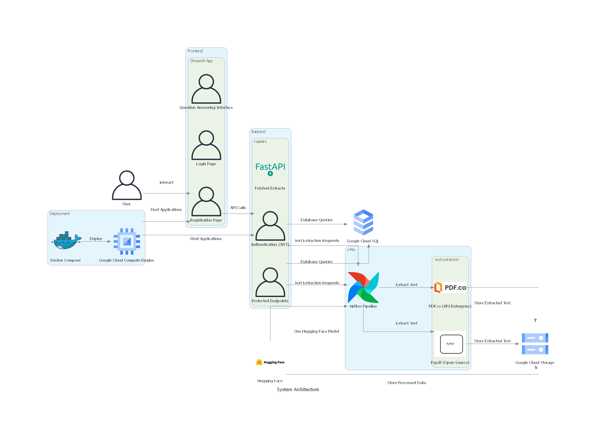

# InformaPDF

## Project Overview

This project, titled "InformaPDF," is designed to streamline the process of text extraction from PDF files and provide a secure, user-friendly client-facing application. The project consists of two main parts: automating text extraction using Airflow pipelines and developing a client-facing application using Streamlit and FastAPI.

Codelab [link](https://codelabs-preview.appspot.com/?file_id=1PtPbQA_wmCll14lt--FDn1jZeQYlErJ-qFyUNH8iI1g#0)

WE ATTEST THAT WE HAVEN'T USED ANY OTHER STUDENTS' WORK IN OUR ASSIGNMENT AND ABIDE BY THE POLICIES LISTED IN THE STUDENT HANDBOOK
Contribution: 
Vaishnavi Veerkumar: Google Cloud Storage setup, Airflow pipeline for downloading PDFs from Hugging Face to Google Cloud Storage, updated pipeline to include extraction of contents from the PDFs using PyPDF library and PDF.co API, uploading extracted text back to GCS, setting up Google Cloud Run, and deploying FASTAPI and Streamlit using Docker to Google Cloud.
Sriram Venkatesh: Poetry setup, FastAPI JWT token code, dotenv structure, Google cloud Storage setup and configuration, Documentation, Integration of FastAPI with Streamlit, Diagrams code, Readme for Github, connection with cloud of google cloud MySQL
Siddharth Pawar: Streamlit, Documentation

## Table of Contents

- [Technologies Used](#technologies-used)
- [Setup and Installation](#setup-and-installation)
- [Environment Setup](#environment-setup)
  - [Installing python-dotenv](#installing-python-dotenv)
  - [Loading Environment Variables in Your Code](#loading-environment-variables-in-your-code)
- [Running the Project](#running-the-project)
  - [Airflow Pipelines](#airflow-pipelines)
  - [FastAPI Application](#fastapi-application)
  - [Streamlit Application](#streamlit-application)
  - [Deployment](#deployment)

## Technologies Used

- **Apache Airflow**: For automating the data acquisition process for PDF files.
- **Text Extraction Tools**: Pypdf (open-source) and PDF.co (API/enterprise) for text extraction.
- **FastAPI**: For implementing user registration, login functionality, and JWT authentication.
- **Streamlit**: For developing the user-friendly registration, login, and Question Answering interface.
- **SQL Database**: For storing user login credentials securely.
- **Docker Compose**: For containerizing and deploying the applications to a public cloud platform.
- **GitHub**: For version control and collaboration.

## Setup and Installation

### Dependencies

This project uses `poetry` for dependency management. Here’s how to set up the project:

```bash
# Install poetry
curl -sSL https://install.python-poetry.org | sh
```

# Clone the repository
```bash
git clone https://github.com/your-repo/your-project.git
cd your-project
```

# Install dependencies using poetry
```bash
poetry install
```

## Environment Setup
Ensure you have the necessary environment variables set up, especially for database connections and cloud services.

To install python-dotenv, use the following command:
```bash
poetry add python-dotenv
```

### Loading Environment Variables in Your Code

In your FastAPI or any Python application, you can load the environment variables from the `.env` file by adding the following lines in your code:

```python
from dotenv import load_dotenv
import os

# Load the environment variables from the .env file
load_dotenv()

# Access the environment variables
database_url = os.getenv('DATABASE_URL')
s3_bucket = os.getenv('S3_BUCKET')
pdf_co_api_key = os.getenv('PDF_CO_API_KEY')
```

### Example Environment Variables

```bash
export DATABASE_URL="your_database_url"
export S3_BUCKET="your_s3_bucket"
export PDF_CO_API_KEY="your_pdf_co_api_key"
```

## Running the Project

### Airflow Pipelines
To run the Airflow pipelines, navigate to the `airflow` directory and start the Airflow server:

```bash
cd airflow
airflow db init
airflow webserver -p 8080
airflow scheduler
```

## FastAPI Application

To run the FastAPI application, use the following command:

```bash
docker build -t gcr.io/[GCP_PROJECT_ID]/fastapi-app -f [FASTAPI_DOCKERFILE] .
docker push gcr.io/[GCP_PROJECT_ID]/fastapi-app
gcloud run deploy fastapi-service --image gcr.io/[GCP_PROJECT_ID]/fastapi-app --platform managed --region us-east1 --allow-unauthenticated --port 8000
```

## Streamlit Application
```bash
docker build -t gcr.io/[GCP_PROJECT_ID]/streamlit-app -f [STREAMLIT_DOCKERFILE] .
docker push gcr.io/[GCP_PROJECT_ID]/streamlit-app
gcloud run deploy streamlit-service --image gcr.io/[GCP_PROJECT_ID]/streamlit-app --platform managed --region us-east1 --allow-unauthenticated --port 8501
```

## Deployment

To deploy the applications to a public cloud platform using Docker Compose, follow these steps:

```bash
docker-compose build .
docker-compose up -d
```


## License

[MIT](https://choosealicense.com/licenses/mit/)
